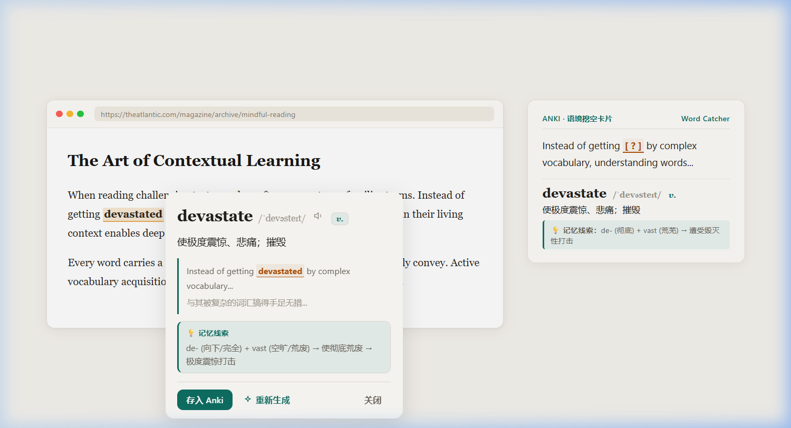

<div align="center">
  
  <h1>Word Catcher</h1>
  <p>一个支持多种查词模式、快速集成 Anki 单词本的网页划词学习扩展。</p>

  <p>
    
    
    
  </p>
</div>

<p align="center">
  
</p>

---

## 💡 这个插件适合什么场景？

在网页阅读英文文章或文档时，遇到生词通常有两种诉求：
1. **快速知道意思**：不想打断阅读节奏，快速看一眼翻译或基本释义；
2. **结合句子深入理解并记忆**：有些词在特定语境下含义特殊，需要结合原句理解，并希望顺手存进 Anki 供后续复习。

Word Catcher 围绕这两个场景提供了灵活的查词模式与 Anki 一键存卡能力。

---

## 🛠️ 主要功能

### 1. 多种查词模式，按需选择
* **即时机翻**：划选单词或长句时直接调用在线翻译（支持微软/谷歌翻译），免配置直用，适合快速扫读；
* **本地词库（可选）**：支持在设置中下载并接入开源词典文件（Open Dictionary），在本地快速检索词性、音标与记忆线索；
* **AI 语境释义**：将划选词与**当前整句话**发送给大模型，解释该词在当前语境下的精确含义并翻译整句（支持 DeepSeek、OpenAI、Kimi、Ollama 等任意兼容接口）。

### 2. 快速存入 Anki 单词本
* 查词后点击「**存入单词本**」，通过本地 AnkiConnect 插件自动建卡；
* 卡片自动带上网页原句、整句翻译、词性音标与记忆线索，并支持生成语境挖空（Cloze）、看词识义等多维度复习卡片；
* **离线安全队列**：Anki 客户端没开时保存不会丢失，会自动进入待写队列，Anki 启动后点击即可一键补写。

---

## 🚀 快速开始

### 步骤 1：准备 Anki
1. 启动 [Anki 桌面版](https://apps.ankiweb.net/)；
2. 安装 AnkiConnect 插件：点击菜单栏「工具」→「附加组件」→「获取附加组件」→ 输入代码 **`2055492159`** 安装并重启 Anki。

### 步骤 2：安装扩展

#### 方式 A：直接下载安装包
1. 在 GitHub 页面右侧 **[Releases](https://github.com/)** 下载最新的 `word-catcher-chrome.zip`（Firefox 用户下载 `word-catcher-firefox.zip`）；
2. 解压到本地任意目录；
3. 打开 Chrome / Edge 扩展管理页面（`chrome://extensions`），开启「**开发者模式**」；
4. 点击「**加载已解压的扩展程序**」，选择解压后的目录即可。

#### 方式 B：从源码编译
```bash
git clone <本仓库地址>
cd word-catcher
pnpm install
pnpm build
```
在浏览器扩展页面加载 `.output/chrome-mv3` 目录。

### 步骤 3：基础配置
初次使用打开扩展设置页：
* 如需使用 AI 语境释义：填入 API Key 和模型名称；
* 如需本地词库：在「离线词典」分区点击下载开源词库包；
* 点击「测试连接并同步卡片模板」确认 Anki 连接正常。

---

## 📖 划词操作与触发方式

在「设置 → 划词与朗读」中可以根据个人习惯设置触发方式：
* **先显示操作胶囊**（默认）：划词后弹出快捷操作条，自由选择「快译」或「AI 释义」；
* **直接快速翻译**：划选后立即弹出机翻/词库结果，需要时仍可在面板内点击升级 AI 释义；
* **直接 AI 释义**：划选后直接调用大模型结合上下文分析。

---

## 常见问题 (FAQ)

* **连不上 Anki？**  
  请确认 Anki 桌面端正在运行，且已安装 AnkiConnect 插件（代码 `2055492159`）。
* **提示「已在牌组」？**  
  插件默认会根据单词原形在 Anki 对应牌组中查重，避免重复制卡。
* **是否必须配置 AI？**  
  不是必须。如果不配置 AI Key，仍可正常使用机翻与本地词库进行查词与存卡。

---

## 鸣谢与开源许可 (Acknowledgments)

本项目支持接入与依赖以下优秀的开源项目：

* **[Open Dictionary](https://github.com/ahpxex/open-dictionary)** (by [@ahpxex](https://github.com/ahpxex))  
  提供开源离线词典数据源。其词典数据基于 [CC BY-SA 4.0](https://creativecommons.org/licenses/by-sa/4.0/) 协议（衍生自 Wiktionary），项目源码遵循 MIT License。
* **[Anki-Connect](https://git.sr.ht/~foosoft/anki-connect)** (by [@FooSoft](https://foosoft.net/projects/anki-connect/))  
  提供与本地 Anki 桌面端通信的 API 桥梁。
* 本扩展自身源码遵循 **[MIT License](LICENSE)** 开源协议。
